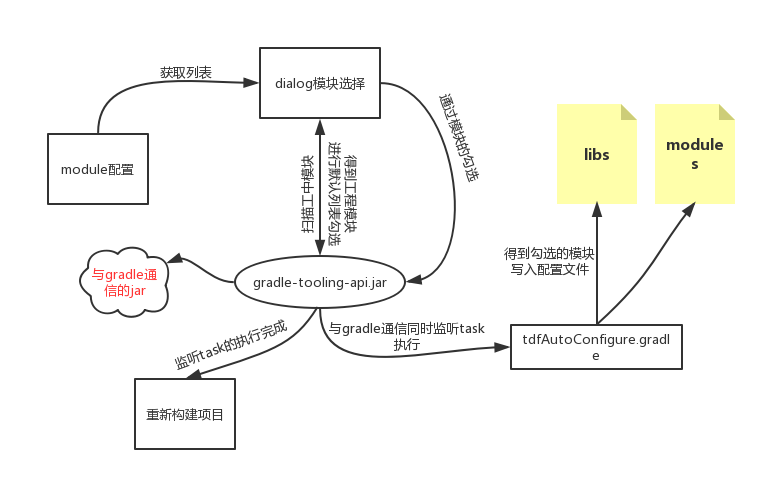
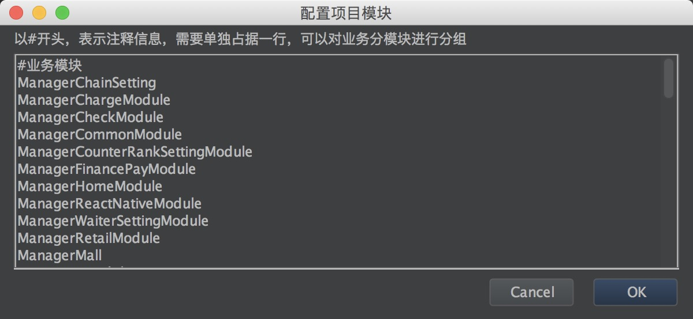

# tdfAuto
项目组件化开发的Android Studio插件，一个视图化工具，通过界面形式，来简化模块加载和卸载需要手动修改配置文件操作。

**使用插件需要有一定的android gradle基础知识以及对构建生命周期的理解**


## 一张图描述插件的原理


## 插件使用

#### 插件安装
* 可以直接获取项目列表中的 **tdfAuto.zip** 进行安装
* 安装完成后，菜单栏最右侧出现插件的按钮
* 插件有两个按钮，config 和 module 

#### 配置插件config
首先需要在config中配置项目中的模块，如下图：


#### 模块选择module
点击模块选择，列表会展示config中配置的模块，会读取当前项目中include的模块，在弹出的列表中默认勾选上include的模块，
选择完成后点击 ok ，在项目中接收到勾选模块的信息，则需要与glrade通信，通过gradle task 接收传递过来的勾选模块的信息。

#### 项目中接收模块信息的配置
可以创建一个.gralde文件，存放以下task的代码，在doLast中处理接收到的模块信息。

**注意**
* task名字名字不能乱写，在插件中默认会调用名为performToSelectModule的task。
* requiredModules 也是固定的名字。
**拷贝以下代码对在doLast中写上对模块的相应处理即可，建议：对接收到的模块写到配置文件中，其他gradle构建时，读取配置文件中的模块**

```groovy
/**
 * 选择的模块依赖
 */
final PROPERTY_REQUIRED_MODULES = 'requiredModules'
/**
 *  选择module
 *  执行任务的参数'-PrequiredModules= {@需要切到的module的name ， 以 '-' 隔 开}
 *  Note:'-P'是执行任务的时候附加的property变量
 *  加快任务执行的command 参数：'--parallel --max-workers=8 --configure-on-demand --offline'
 * ./gradlew performToSelectModule -PrequiredModules=app-base-tempbase-manager.app --parallel --max-workers=8 --configure-on-demand --offline
 */
task performToSelectModule {
    //接收模块信息
    String[] requiredModules = null
    if (project.hasProperty(PROPERTY_REQUIRED_MODULES)) {
        requiredModules = project.getProperties().get(PROPERTY_REQUIRED_MODULES).split('-')
    }
    doLast {
       //接收模块处理逻辑..
        println "----------performToSelectModule 任务完成----requiredModules=${requiredModules}----------"
    }
}

```


# 最后
插件已经在实际项目应用，后续会在我的个人项目中也进行配置，具体可以关注我的练手项目[Towards](https://github.com/zguop/Towards)

-
xiexie ni de guāng gù ！ 喜欢的朋友轻轻右上角赏个star。


